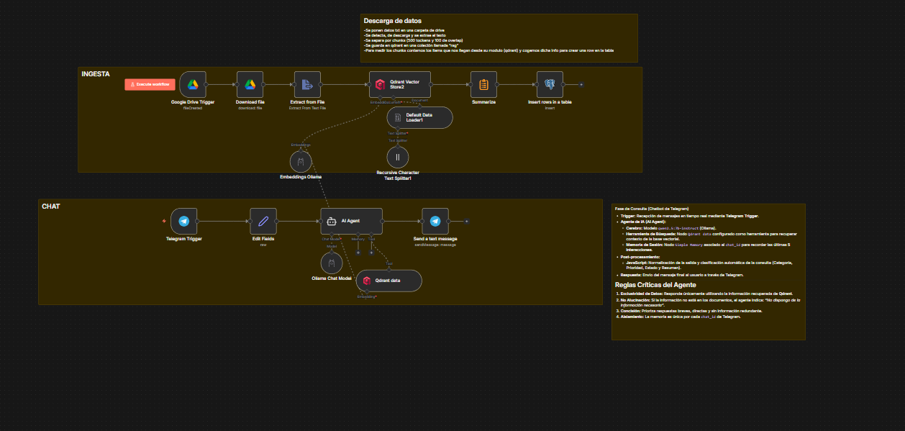
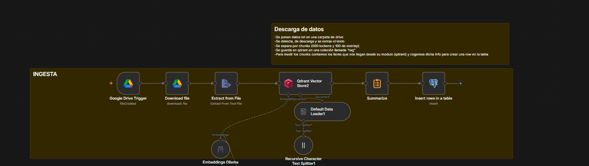
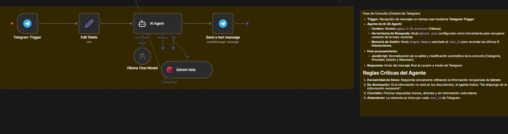

# 📖 Documentación: Chatbot RAG (Telegram) - Hito 3

## Índice

1. [Descripción General](#descripción-general)
2. [Arquitectura del Workflow](#arquitectura-del-workflow)
3. [Diagrama de Flujo](#diagrama-de-flujo)
4. [Nodos del Workflow](#nodos-del-workflow)
   - [Fase 1: Ingesta de Documentos](#fase-1-ingesta-de-documentos)
   - [Fase 2: Interfaz de Chat (Telegram)](#fase-2-interfaz-de-chat-telegram)
5. [Contenedores y Servicios Utilizados](#contenedores-y-servicios-utilizados)
6. [Modelos de IA](#modelos-de-ia)
7. [Base de Datos y Almacenamiento](#base-de-datos-y-almacenamiento)
8. [Configuración y Credenciales](#configuración-y-credenciales)

---

## Descripción General

**Chatbot RAG - Hito 3** es un workflow de n8n diseñado para implementar un sistema de **Generación Aumentada por Recuperación (RAG)** integrado directamente con **Telegram**. 

El sistema tiene dos propósitos principales que funcionan en paralelo:
1. **Ingesta automática:** Monitoriza una carpeta específica de Google Drive. Cuando se sube un nuevo documento, lo descarga, extrae su texto, lo segmenta (chunking), lo vectoriza y lo almacena en una base de datos vectorial (Qdrant). Paralelamente, registra metadatos de esta ingesta en PostgreSQL.
2. **Consulta RAG:** Recibe preguntas de los usuarios a través de un bot de Telegram, busca información relevante en los documentos vectorizados, y un modelo de lenguaje (LLM local) genera una respuesta que se ciñe estrictamente al contexto extraído.



---

## Arquitectura del Workflow

El sistema sigue un patrón de **RAG Clásico con separación de ingesta y recuperación**, compuesto por dos ramas independientes dentro del mismo workflow:

**Fase de Ingesta (Preparación de datos):**
```
[GOOGLE DRIVE] → [DESCARGA Y EXTRACCIÓN] → [CHUNKING] → [EMBEDDINGS] → [QDRANT]
                                                          ↳ [RESUMEN METADATOS] → [POSTGRESQL]
```

**Fase de Chat (Consulta y Respuesta):**
```
[TELEGRAM EVENT] → [PARSEO DATOS] → [AI AGENT (LLM + TOOL QDRANT)] → [RESPUESTA A TELEGRAM]
```

---

## Diagrama de Flujo

### Fase de Ingesta


### Fase de Consulta (Chat)


---

## Nodos del Workflow

### Fase 1: Ingesta de Documentos

#### `Google Drive Trigger`
- **Tipo:** `n8n-nodes-base.googleDriveTrigger`
- **Evento:** `fileCreated` (Archivo creado)
- **Carpeta:** `RAG`
- **Descripción:** Se dispara automáticamente (por *polling*) cada minuto cuando detecta que un usuario ha subido un nuevo archivo a la carpeta especificada de Drive.

#### `Download file` y `Extract from File`
- **Descripción:** Descargan el archivo binario desde Google Drive y extraen el contenido en texto plano.

#### `Default Data Loader` & `Recursive Character Text Splitter`
- **Configuración Splitter:** 
  - `chunkSize`: 500
  - `chunkOverlap`: 100
- **Descripción:** Divide el texto completo extraído del documento en pequeños fragmentos (chunks) de 500 caracteres, con un solapamiento de 100 caracteres entre ellos, optimizando así el contexto para el modelo vectorial.

#### `Qdrant Vector Store` (Inserción) & `Embeddings Ollama`
- **Colección:** `rag`
- **Modelo de embedding:** `nomic-embed-text:latest` (Ollama)
- **Descripción:** Convierte los fragmentos de texto en vectores numéricos y los almacena en Qdrant.

#### `Summarize` & `Insert rows in a table` (Postgres)
- **Base de Datos:** `chatbot_rag`
- **Tabla:** `documentos`
- **Descripción:** El nodo *Summarize* cuenta la cantidad de *chunks* generados. Después, el nodo de PostgreSQL inserta un registro con el **nombre** original del archivo (`originalFilename`), la **fecha** de ingesta (`now`) y el **número total de chunks** insertados en la base relacional simultáneamente.

---

### Fase 2: Interfaz de Chat (Telegram)

#### `Telegram Trigger`
- **Tipo:** `n8n-nodes-telegram-polling.telegramPollingTrigger`
- **Evento:** Actualizaciones de mensajes
- **Descripción:** Actúa como el puente de entrada escuchando todos los mensajes que los usuarios envían al Bot de Telegram.

#### `Edit Fields` (Parseo)
- **Descripción:** Extrae de manera limpia el `chat_id`, el `username` y el texto del `mensaje` para construir un objeto JSON que sirva como prompt de sistema fácilmente manejable por el Agente.

#### `AI Agent` (RAG)
- **Tipo:** `@n8n/n8n-nodes-langchain.agent` (Agente de LangChain v3.1)
- **Componentes Conectados:**
  - **Cerebro / LLM:** `Ollama Chat Model` (Modelo: `qwen2.5:7b-instruct`)
  - **Herramienta:** `Qdrant data` (En formato `retrieve-as-tool`) leyendo de la colección `rag` mediante el modelo local de embeddings `nomic-embed-text:latest`.
- **Instrucción de Sistema (Prompting Crítico):**
```markdown
Eres un asistente que responde preguntas utilizando EXCLUSIVAMENTE información procedente de documentos que han sido vectorizados (PDF o TXT) y almacenados en una base vectorial (Qdrant).
Tu conocimiento se limita únicamente al contenido recuperado mediante RAG desde esos documentos.
No debes usar conocimiento externo, suposiciones ni información que no esté presente en el contexto recuperado.
Debes responder de forma clara y directa basándote solo en el contexto proporcionado.
Reglas:
1. Usa únicamente la información presente en el CONTEXTO recuperado del RAG.
2. No inventes información ni completes con conocimiento externo.
3. Recorta la información obtenida si no es necesaria para dar una respuesta directa.
4. Si qdrant no contiene la respuesta, indícalo claramente sin mencionar qdrant, di algo como "no dispongo de la informacion necesaria para responder a su mensaje: {{ $json.mensaje }}".
5. No hagas suposiciones si los datos no aparecen en el contexto.
6. Prioriza respuestas breves y precisas basadas en los documentos.
PREGUNTA:
{{ $json.mensaje }}
```

#### `Send a text message` (Telegram)
- **Descripción:** Devuelve la respuesta generada por el `AI Agent` de vuelta al ID de chat (`chat_id`) del usuario que hizo la pregunta en Telegram, cerrando el ciclo. Se permite el parseo en formato HTML para respuestas con enlaces y estructuras enriquecidas.

---

## Contenedores y Servicios Utilizados

El entorno del sistema está soportado por un stack integrado en **Docker Compose** (`docker-compose.yml`):

1. **`n8n_ia`:** Motor principal de la automatización que ejecuta el flujo RAG. Expuesto en el puerto `50000:5678`.
2. **`ollama`:** Provee localmente los modelos de IA tanto para inferencia (texto) como para cálculo de embeddings vectoriales.
3. **`postgres`:** Almacena la base de datos relacional para el registro de subida de los documentos.
4. **`pgadmin_ia`:** Interfaz gráfica web para poder explorar de forma visual los datos guardados de los documentos insertados.
5. **`qdrant_ia`:** Motor de la base de datos vectorial ultrarrápida (puertos `6333` y `6334`), encargada de la búsqueda por similitud semántica.

*(Todos estos múltiples contenedores se comunican a través de la misma red interna de Docker `chatbot-net` para funcionar sin latencias u obstáculos de firewall).*

---

## Modelos de IA

A diferencia del Chatbot Multiherramienta, este workflow delega el trabajo principal de generación y razonamiento semántico en **dos** modelos específicos servidos localmente por Ollama:

| Nodo | Modelo (Ollama) | Propósito |
|------|----------------|-----------|
| `AI Agent` | `qwen2.5:7b-instruct` | Análisis de la pregunta de Telegram, filtrado estricto del contexto recuperado de Qdrant, y generación de la respuesta final natural limitándose a este. |
| `Embeddings Ollama` | `nomic-embed-text:latest` | Creación de vectores. En fase inyecta y vectoriza el documento original, en fase chat genera el vector semántico sobre la búsqueda del usuario. |

---

## Base de Datos y Almacenamiento

### 1. Vectorial (Qdrant)
- **Colección (Collection):** `rag`
- **Operación:** Su rol es comparar algoritmos de similitud de cosenos para devolver los "chunks" o trozos de texto recabados como contexto para enviarlos al modelo *Qwen2.5*.

### 2. Relacional (PostgreSQL)
- **Base de Datos:** `chatbot_rag`
- **Tabla:** `documentos` (Implementada automáticamente vía `init.sql`)
- Sirve como "hoja de registro". Apunta la información generada registrando la trazabilidad de ingesta con la siguiente estructura y datos de `Download file`:

| Campo | Tipo | Función |
|-------|------|---------|
| `id` | SERIAL (PK) | Identificador principal automático de inserción. |
| `nombre` | VARCHAR(255) | Nombre del documento original subido a Google Drive. |
| `num_chunks` | INTEGER | Cantidad de particiones generadas de dicho text para la base de datos. |
| `fecha` | TIMESTAMP | Marca de tiempo automatizada con la inserción y ejecución (`NOW()`). |

---

## Configuración y Credenciales

Para el correcto funcionamiento de este workflow independiente en n8n, se apoya en las siguientes credenciales autorizadas en su entorno:

| Credencial n8n | Usada por... | Propósito |
|------------------|--------------|-----------|
| `Google Drive account` (OAuth2) | Google Drive Trigger y Download file | Da autorización para monitorizar e importar externamente los PDFs/textos. |
| `QdrantApi account` | Qdrant Vector Store y Qdrant data (Tool) | Autenticar y comunicar la subida y búsqueda con la red del contenedor `qdrant_ia`. |
| `Ollama account` | Agente LLM y Embeddings | Acceso ininterrumpido a la API interna del contenedor de Ollama. |
| `TelegramRagBot` | Polling Trigger de Telegram y Message Send | Token seguro para manejar el bot provisto por el *BotFather* de Telegram. |
| `Postgres_Rag_Hito3` | Nodo *Insert rows in a table* | Permite hacer querys directas sobre la tabla relacional con el super-usuario `ia_user`. |